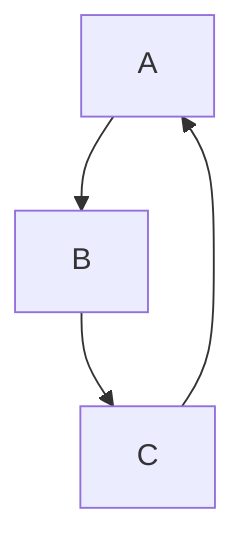
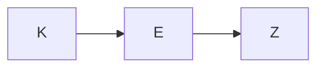
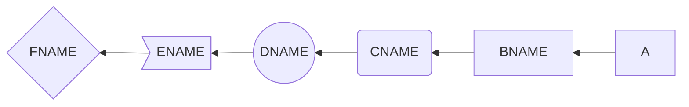
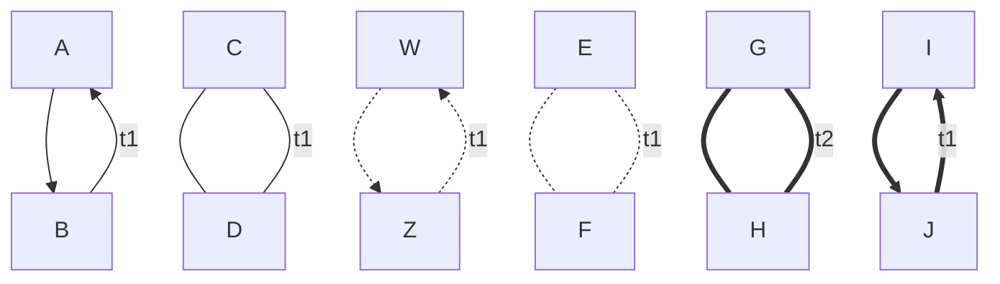
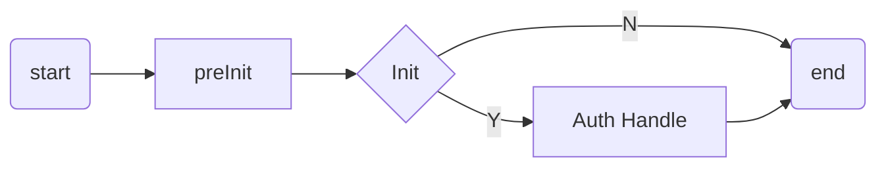
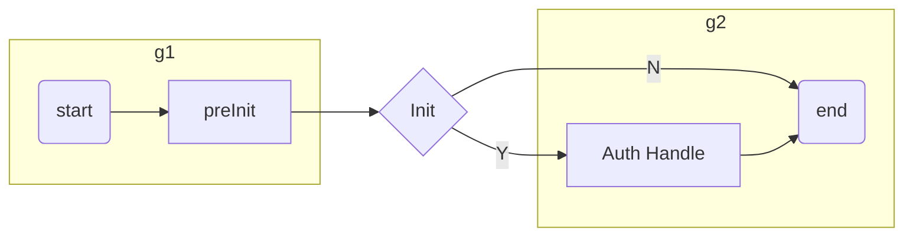
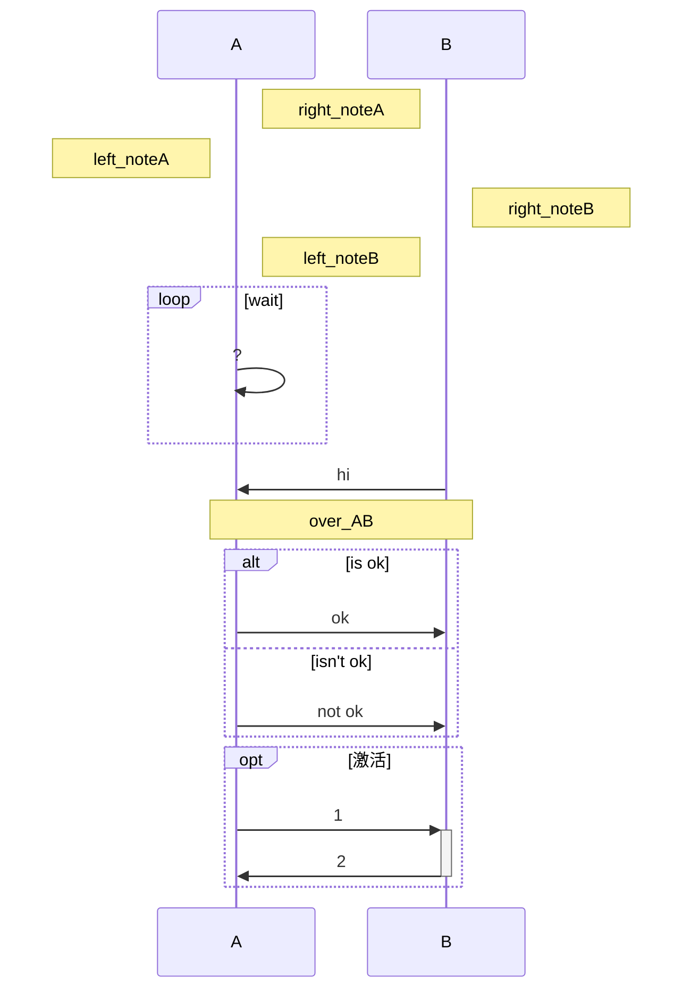
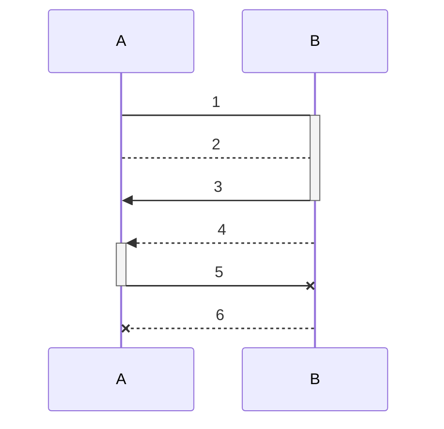
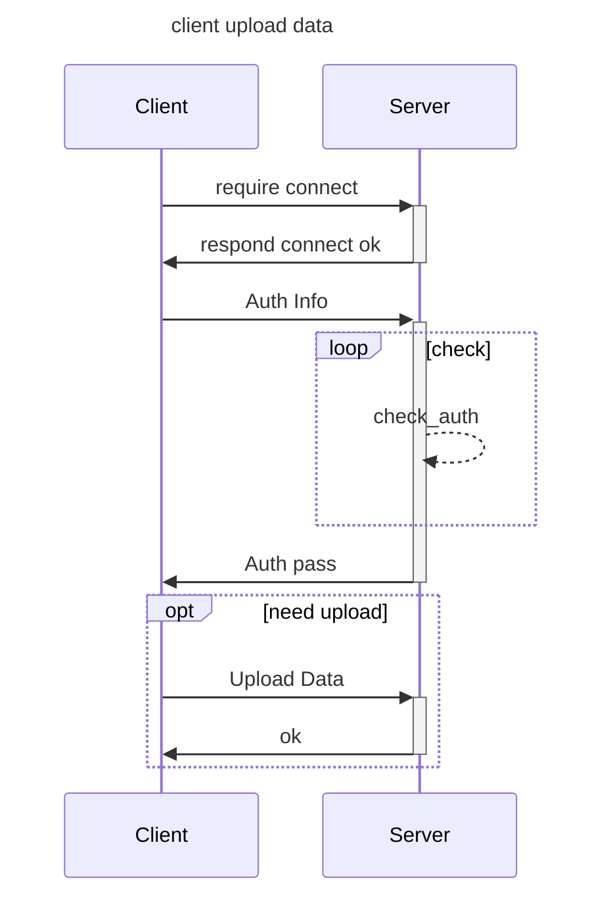

### 1. 使用mermaid绘图引擎

**vscode如何使用mermaid绘图。**

- 安装Markdown All in One，Markdown Preview Enhanced
- Ctrl+Shift+P，Markdown Preview Enhanced: Open Mermaid Config
- 复制粘贴

```Plain Text
//设置mermaid绘图的风格
//一共有三个主题：
// mermaid.css
// mermaid.dark.css
// mermaid.forest.css
Mermaid_Theme={
theme:mermaid.forest.css 
}
```


#### 1. graph（流程图）

- **图的方向**：
  - TB，TD从上到下
  - BT从下到上
  - RL从右到左
  - LR从左到右

> T=TOP;B=BOTTOM;L=LEFT;R=RIGHT;D=DOWN;

```Plain Text



```


- **节点形状**

  - 默认矩形节点：A
  - 文本节点：B[bname]
  - 圆角节点：C(cname)
  - 圆形节点：D((dname))
  - 非对称节点：E>ename]
  - 菱形节点：F{fname}

```Plain Text

```


- **连线类型**

  - 箭头：A-->B,A<---B
  - 开放连接：A---B
  - 标签连接：A-t1--B
  - 箭头带标签：A--t1-->B
  - 虚线开放连接：A-.-B
  - 虚线带箭头连接：A-.->B
  - 标签虚线连接：A-.t1.-B
  - 标签虚线带箭头连接：A-.t1.->B
  - 粗线开发连接：A===B
  - 粗线箭头连接：A==>B
  - 标签粗线开放连接：A\=\=t1===B
  - 标签粗线箭头连接：A\=\=t1==>B

总结：
- P1: -- 为细线，==为粗线，-.-为虚线
- P2: -t1-为细线文本，=t1=为粗线文本，.t1.为虚线文本
- P3: >有箭头，-细线无箭头，=粗线无箭头

A P1 P2 P3 B

```Plain Text

```


- **流程图示例**

```Plain Text

```


#### 2. subgraph（子图）

- **subgraph格式**
```Plain Text
# 外面的那层, 可以使用子图中的节点，子图中的节点名不是隔离的，可以认为是全局变量
graph LR
  subgraph title1
    graph definition 
  end
  subgraph title2
    graph definition 
  end
  ...
```


- **subgraph示例**

```Plain Text

```


```Plain Text

```


#### 3. sequence diagram（序列图）

- **关键字**

  - participant，参与者
  - title，标题
  - note，注释，note right/left of actor / note over actor1,actor2:Text
  - loop loot_text ... end，循环
  - 选择，alt des_text .. else ... end, opt des_text ... end，只有一个选项使用opt
  - 激活框，+ actor激活，- actor不激活
  - 并行执行，par par_name ... and ... end

```Plain Text

```


- **连线**

  - 无箭头实线 ->
  - 带箭头实线 ->>
  - 无箭头虚线-->
  - 带箭头虚线-->>
  - 带x实线 -x
  - 带x虚线 --x

```Plain Text

```


- **示例**

```Plain Text

```


#### 4.  gantt diagram（甘特图）

- **关键字**
  - dateFormat，日期格式
  - section，模块
  - Completed，已经完成
  - Active，当前正在进行的
  - Futrue，后续待处理
  - crit，关键阶段
  - title，标题
  - done，完成

- **示例**

```Plain Text
```mermaid
gantt
    dateFormat  YYYY-MM-DD
    title Adding GANTT diagram functionality to mermaid

    section A section
    Completed task            :done,    des1, 2014-01-06,2014-01-08
    Active task               :active,  des2, 2014-01-09, 3d
    Future task               :         des3, after des2, 5d
    Future task2               :         des4, after des3, 5d

    section Critical tasks
    Completed task in the critical line :crit, done, 2014-01-06,24h
    Implement parser and jison          :crit, done, after des1, 2d
    Create tests for parser             :crit, active, 3d
    Future task in critical line        :crit, 5d
    Create tests for renderer           :2d
    Add to mermaid                      :1d

    section Documentation
    Describe gantt syntax               :active, a1, after des1, 3d
    Add gantt diagram to demo page      :after a1  , 20h
    Add another diagram to demo page    :doc1, after a1  , 48h

    section Last section
    Describe gantt syntax               :after doc1, 3d
    Add gantt diagram to demo page      : 20h
    Add another diagram to demo page    : 48h

```
```

```mermaid
gantt
    dateFormat  YYYY-MM-DD
    title Adding GANTT diagram functionality to mermaid

    section A section
    Completed task            :done,    des1, 2014-01-06,2014-01-08
    Active task               :active,  des2, 2014-01-09, 3d
    Future task               :         des3, after des2, 5d
    Future task2               :         des4, after des3, 5d

    section Critical tasks
    Completed task in the critical line :crit, done, 2014-01-06,24h
    Implement parser and jison          :crit, done, after des1, 2d
    Create tests for parser             :crit, active, 3d
    Future task in critical line        :crit, 5d
    Create tests for renderer           :2d
    Add to mermaid                      :1d

    section Documentation
    Describe gantt syntax               :active, a1, after des1, 3d
    Add gantt diagram to demo page      :after a1  , 20h
    Add another diagram to demo page    :doc1, after a1  , 48h

    section Last section
    Describe gantt syntax               :after doc1, 3d
    Add gantt diagram to demo page      : 20h
    Add another diagram to demo page    : 48h

```

#### 5. flow（复杂流程图，相较于graph）

- **模块关键字**

  - start/end，表示程序的开始与结束
  - operation，表示程序的处理块
  - subroutine，表示子程序块
  - condition，表示程序的条件判断
  - inputoutput，表示程序的出入输出
  - right/left，表示当前连线在当前模块上的起点(默认从下端开始)
  - yes/no， 表示condition判断的分支(可以和right，left同时使用)

- **模块的定义**

格式：模块名=>模块关键字: 模块显示文本

**模块名相当于变量名，模块显示文本表示显示的文本内容。**

注意：模块显示文本前**有一个空格**！！！

- **模块的连接**

连接格式：模块名A->模块B->...，连接时可以使用right、left确定箭头的起点。

使用condition关键词定义的判断框需要结合yes和no使用，例如：

```Plain Text
cond1=>condition: x>0?
cond1(yes)->module1
cond1(no)->module2
```


- **示例**

```Plain Text
```flow
flowchat
st=>start: 开始
e=>end: 结束
in_app=>inputoutput: 输入app信息
in_auth=>inputoutput: 输入auth信息
cond_app=>condition: app信息为空?
cond_auth=>condition: auth信息为空?
sub_auth_in=>subroutine: 内部认证
op_check=>operation: 验证app和auth信息

st->in_app->cond_app
cond_app(yes)->in_auth(right)->cond_auth
cond_app(no,left)->e
cond_auth(yes)->op_check
cond_auth(no, left)->sub_auth_in->op_check
op_check(left)->e
```
```

```flow
flowchat
st=>start: 开始
e=>end: 结束
in_app=>inputoutput: 输入app信息
in_auth=>inputoutput: 输入auth信息
cond_app=>condition: app信息为空?
cond_auth=>condition: auth信息为空?
sub_auth_in=>subroutine: 内部认证
op_check=>operation: 验证app和auth信息

st->in_app->cond_app
cond_app(yes)->in_auth(right)->cond_auth
cond_app(no,left)->e
cond_auth(yes)->op_check
cond_auth(no, left)->sub_auth_in->op_check
op_check(left)->e
```
